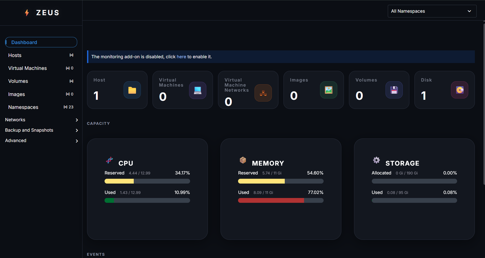
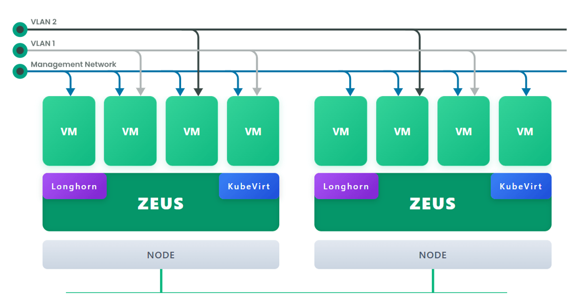
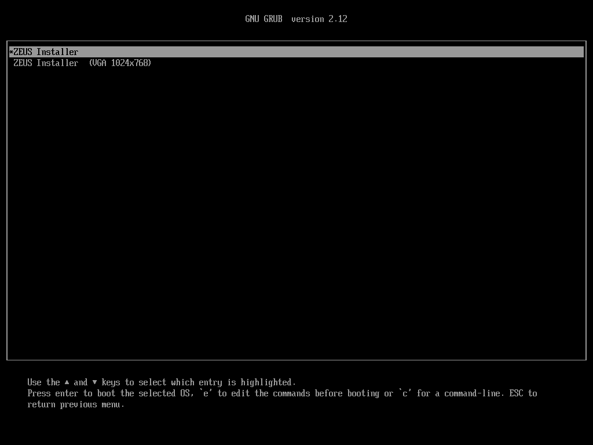
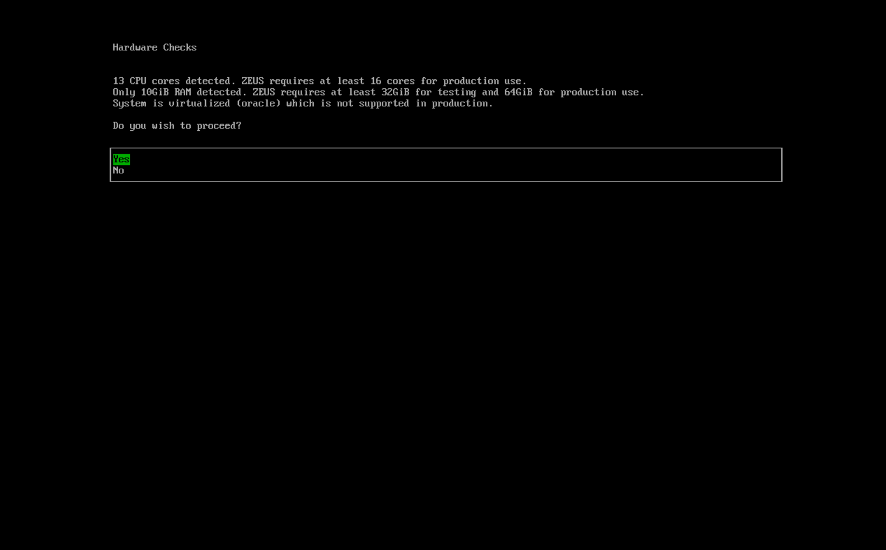
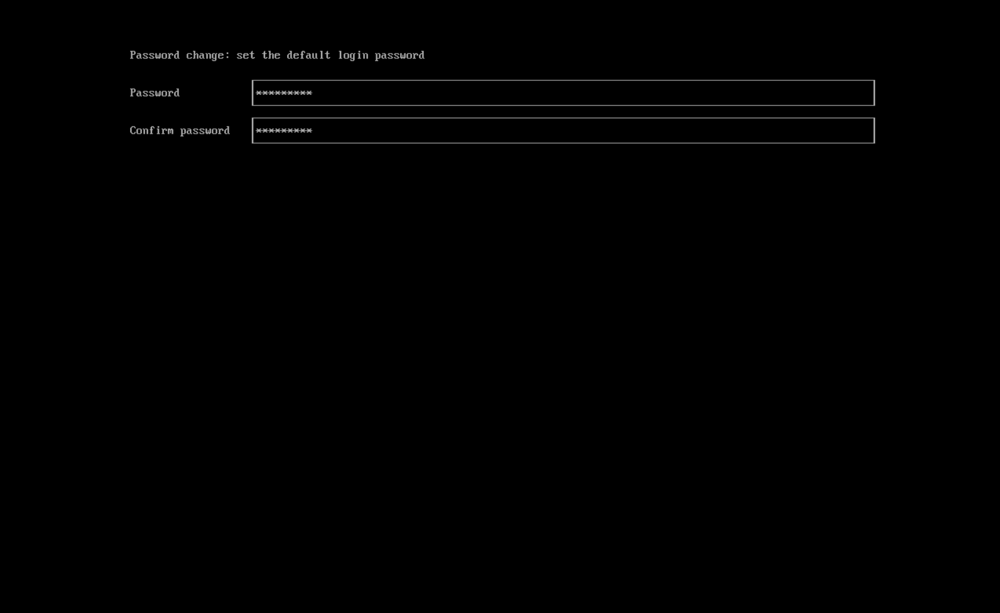
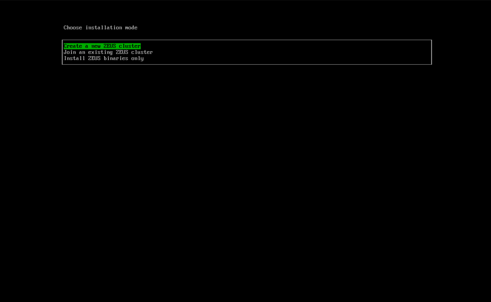
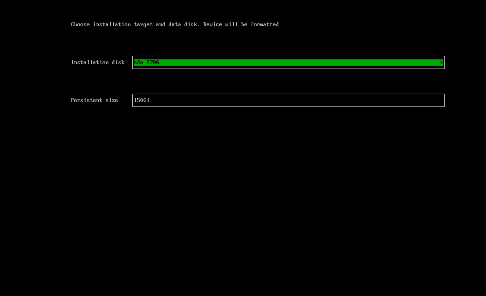
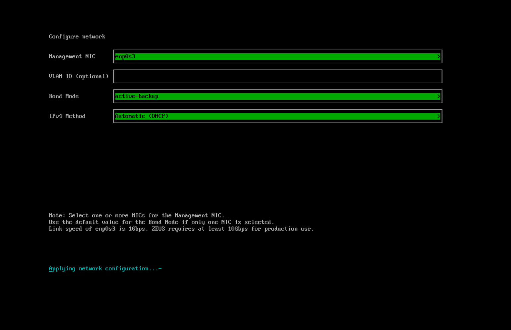
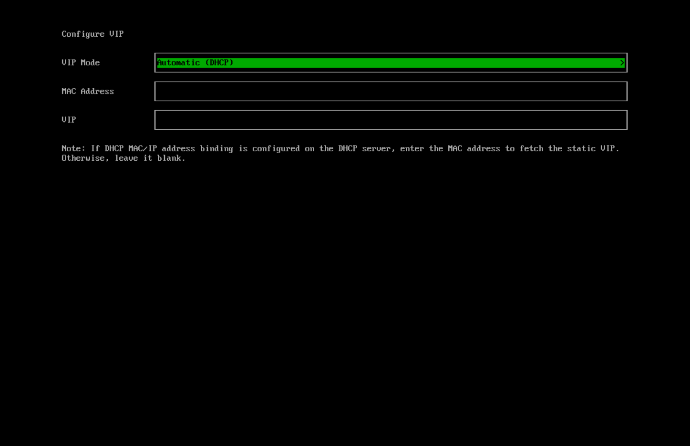
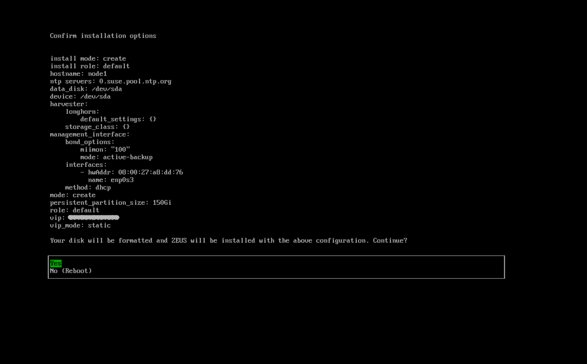

EdgeMatrix
========


[EdgeMatrix](https://EdgeMatrixhci.io/) is a modern, open, interoperable, [hyperconverged infrastructure (HCI)](https://en.wikipedia.org/wiki/Hyper-converged_infrastructure) solution built on Kubernetes. 
It is  alternative for scale computing' HCI platform designed for operators seeking a [cloud-native](https://about.gitlab.com/topics/cloud-native/) HCI solution. EdgeMatrix runs on bare metal servers and provides integrated virtualization and distributed storage capabilities. 
In addition to traditional virtual machines (VMs), EdgeMatrix supports containerized environments. It offers a solution that unifies legacy virtualized infrastructure while enabling the adoption of containers from core to edge locations.




## Overview
EdgeMatrix is an enterprise-ready, easy-to-use infrastructure platform that leverages local, direct attached storage instead of complex external SANs. It utilizes Kubernetes API as a unified automation language across container and VM workloads. Some key features of EdgeMatrix include:

1. **Easy to install:** Since EdgeMatrix ships as a bootable appliance image, you can install it directly on a bare metal server with the [ISO](https://github.com/sushrut-bhokre/EdgeMatrix-edge/releases) image.
2. **VM lifecycle management:** Easily create, edit, clone, and delete VMs, including SSH-Key injection, cloud-init, and graphic and serial port console.
3. **VM live migration support:** Move a VM to a different host or node with zero downtime.
4. **VM backup, snapshot, and restore:** Back up your VMs from NFS, S3 servers, or NAS devices. Use your backup to restore a failed VM or create a new VM on a different cluster.
5. **Storage management:** EdgeMatrix supports distributed block storage and tiering via [longhorn](https://longhorn.io/). Volumes represent storage; you can easily create, edit, clone, or export a volume.
6. **Network management:** Supports using a virtual IP (VIP) and multiple Network Interface Cards (NICs). If your VMs need to connect to the external network, create a VLAN or untagged network.

## Architecture
The following diagram outlines a high-level architecture of EdgeMatrix:



- [Longhorn](https://longhorn.io/) is a lightweight, reliable, and easy-to-use distributed block storage system for Kubernetes.
- [KubeVirt](https://kubevirt.io/) is a virtual machine management add-on for Kubernetes.
- [Elemental for SLE-Micro 5.3](https://github.com/rancher/elemental-toolkit) is an immutable Linux distribution designed to remove as much OS maintenance as possible in a Kubernetes cluster.

## Hardware Requirements
To get the EdgeMatrix server up and running the following minimum hardware is required:

| Type | Requirements                                                                                                                                                   |
|:---|:---------------------------------------------------------------------------------------------------------------------------------------------------------------|
| CPU | x86_64 only. Hardware-assisted virtualization is required. 8-core processor minimum for testing; 16-core or above required for production                      |
| Memory | 16 GB minimum; 32 GB or above required for production                                                                                                          |
| Disk Capacity | 250 GB minimum for testing (180 GB minimum when using multiple disks); 500 GB or above required for production                                                 |
| Disk Performance | 5,000+ random IOPS per disk (SSD/NVMe). Management nodes (first three nodes) must be [fast enough for etcd](https://www.suse.com/support/kb/doc/?id=000020100) |
| Network Card | 1 Gbps Ethernet minimum for testing; 10Gbps Ethernet required for production                                                                                   |
| Network Switch | Trunking of ports required for VLAN support                                                                                                                    |

We recommend server-class hardware for best results. Laptops and nested virtualization are not officially supported.

## Quick start

You can use the ISO to install EdgeMatrix directly on the bare-metal server to form a EdgeMatrix cluster. Users can add one or many compute nodes to join the existing cluster.

To get the EdgeMatrix ISO, download it from the [Github releases.](https://github.com/sushrut-bhokre/EdgeMatrix-edge/releases)

During the installation, you can either choose to **create a new EdgeMatrix cluster** or **join the node to an existing EdgeMatrix cluster**.

1. Mount the EdgeMatrix ISO file and boot the server by selecting the `EdgeMatrix Installer` option.

1. The EdgeMatrix installer checks if the hardware meets the minimum requirements for production use. If any of the checks fail, installation is stopped and warnings are printed to the system console. Choose whether to proceed with the installation or exit the installer.

  

 1. Change the password for the default user. This password will be used to access the node via SSH.

1. Use the arrow keys to choose an installation mode. By default, the first node will be the management node of the cluster.
   
   - `Create a new EdgeMatrix cluster`: Select this option to create an entirely new EdgeMatrix cluster.
   - `Join an existing EdgeMatrix cluster`: Select this option to join an existing EdgeMatrix cluster. You need the VIP and cluster token of the cluster you want to join.
   - `Install EdgeMatrix binaries only`: If you choose this option, additional setup is required after the first bootup.
1. Choose the installation disk you want to install the EdgeMatrix cluster on and the data disk you want to store VM data on. By default, EdgeMatrix uses [GUID Partition Table (GPT)](https://en.wikipedia.org/wiki/GUID_Partition_Table) partitioning schema for both UEFI and BIOS. If you use the BIOS boot, then you will have the option to select [Master boot record (MBR)](https://en.wikipedia.org/wiki/Master_boot_record).
   
   - `Installation disk`: The disk to install the EdgeMatrix cluster on.
   - `Data disk`: The disk to store VM data on. Choosing a separate disk to store VM data is recommended.
   - `Persistent size`: If you only have one disk or use the same disk for both OS and VM data, you need to configure persistent partition size to store system packages and container images. The default and minimum persistent partition size is 150 GiB. You can specify a size like 200Gi or 153600Mi. 
1. Configure network interface(s) for the management network. By default, EdgeMatrix will create a bonded NIC named `mgmt-bo`, and the IP address can either be configured via DHCP or statically assigned.

1. (Optional) Configure cluster network. Leave blank to use the defaults.
1. Configure the `HostName` of the node.
1. (Optional) Configure the `DNS Servers`. Use commas as a delimiter to add more DNS servers. Leave blank to use the default DNS server.
1. Configure the virtual IP (VIP) by selecting a `VIP Mode`. This VIP is used to access the cluster or for other nodes to join the cluster.

1. Configure the `cluster token`. This token will be used for adding other nodes to the cluster.
1. Configure and confirm a `Password` to access the node. The default SSH user is `rancher`.
1. Configure `NTP servers` to make sure all nodes' times are synchronized. This defaults to `0.suse.pool.ntp.org`. Use commas as a delimiter to add more NTP servers.
1. (Optional) If you need to use an HTTP proxy to access the outside world, enter the proxy URL address here. Otherwise, leave this blank.
1. (Optional) You can choose to import SSH keys by providing `HTTP URL`. For example, your GitHub public keys `https://github.com/<username>.keys` can be used.
1. (Optional) If you need to customize the host with a [EdgeMatrix configuration](https://docs.EdgeMatrixhci.io/latest/install/EdgeMatrix-configuration). file, enter the `HTTP URL` here.
1. Review and confirm your installation options. After confirming the installation options, EdgeMatrix will be installed on your host. The installation may take a few minutes to complete.
1. Once the installation is complete, your node restarts. After the restart, the EdgeMatrix console displays the management URL and status. The default URL of the web interface is `https://your-virtual-ip`. You can use `F12` to switch from the EdgeMatrix console to the Shell and type `exit` to go back to the EdgeMatrix console.

1. You will be prompted to set the password for the default `admin` user when logging in for the first time.


## Documentation

Find more documentation [here](https://docs.EdgeMatrixhci.io/).


## Source code
EdgeMatrix's source code is spread across a number of repos:

| Name                         | Repo Address                                               |
|:-----------------------------|:-----------------------------------------------------------|
| EdgeMatrix                    | https://github.com/sushrut-bhokre/edge-EdgeMatrix                     |
| EdgeMatrix Dashboard          | https://github.com/sushrut-bhokre/EdgeMatrix-UI                       |
| EdgeMatrix Installer          | https://github.com/sushrut-bhokre/EdgeMatrix-installer                |
## Build Instructions

### Prerequisites

- Docker 
- Git
- Go (version defined in `go.mod`)
- Make
> ***Note*** : To build the image you need to have a docker account which you need to login via command line as shown below
### Build ISO

```bash
DOCKERHUB_USERNAME="replace with your dockerhub username"
docker login
sudo cp ~/.docker . -r
export REPO=${DOCKERHUB_USERNAME}
export PUSH=true
sudo chmod +x EdgeMatrix_build.sh
sudo ./EdgeMatrix_build.sh
```
